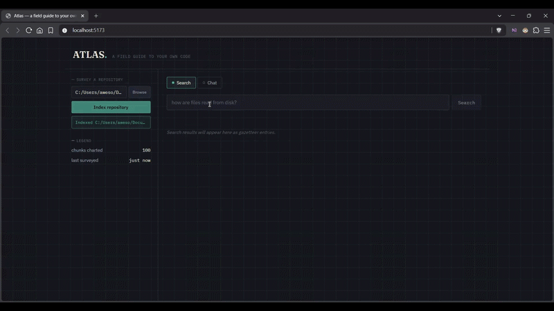

# Atlas

*A field guide to your own code.*

Atlas is a local-first AI assistant for exploring and understanding software repositories. Point it at a repo on your machine, it indexes the code, and you can semantically search it or ask questions about it — all running locally, no code ever leaves your machine.

## Demo



## What it does

- **Survey a repository** — scan a local codebase, ignoring `.git`, `node_modules`, `venv`, build artifacts, etc.
- **Index it** — parse source files into classes/functions/methods, chunk them semantically, and embed each chunk locally via Ollama
- **Search it** — natural language search over the indexed code, ranked by semantic similarity
- **Chat about it** — ask questions and get answers grounded in retrieved chunks from your actual code, with citations

Everything runs locally: parsing, embeddings, vector storage, and the chat model are all on your machine. Nothing is sent to an external API.

## Tech stack

| Component        | Technology                                          |
| :---------------- | :--------------------------------------------------- |
| Frontend          | React + TypeScript + Vite                            |
| Backend API       | FastAPI (Python)                                     |
| Code parsing      | Python `ast` (Python); tree-sitter (JavaScript/TypeScript/TSX) |
| Embeddings        | Ollama — `nomic-embed-text`                          |
| Chat model        | Ollama — `qwen2.5:7b`                                |
| Vector store      | ChromaDB, persisted locally, scoped per repository   |
| Repo browsing     | Native OS folder dialog (via `tkinter`, server-side)  |

## Features

- [x] Browse to or type a local repo path (native folder picker)
- [x] Scan files, skipping irrelevant paths and extensions
- [x] Parse Python (via `ast`) and JavaScript/TypeScript/TSX (via tree-sitter)
- [x] Chunk code into classes, methods, and functions, with token-aware splitting for oversized functions
- [x] Generate embeddings locally via Ollama
- [x] Store embeddings in ChromaDB, scoped per repository (searching one repo never surfaces chunks from another)
- [x] Incremental re-indexing — skips unchanged files, cleans up deleted/renamed ones
- [x] Semantic search with a gazetteer-style results view
- [x] Grounded chat with cited sources
- [x] React frontend wired to all of the above

## Prerequisites

- **Python 3.11+**, with `tkinter` available (bundled by default with the python.org installer on Windows; if you're on a minimal/custom Python install, you may need to install it separately)
- **Node.js 18+**
- **[Ollama](https://ollama.com)**, installed and running locally, with both models pulled:

  ```bash
  ollama pull nomic-embed-text
  ollama pull qwen2.5:7b
  ```

## Setup

### Backend

```powershell
cd backend
python -m venv .venv
.venv\Scripts\Activate.ps1
pip install fastapi "uvicorn[standard]" chromadb requests chardet transformers tree-sitter tree-sitter-javascript tree-sitter-typescript
```

### Frontend

```powershell
cd frontend
npm install
```

## Running

From the repo root:

```powershell
.\run.ps1
```

This opens two windows — the FastAPI backend on `http://localhost:8000`, and the Vite frontend on `http://localhost:5173`. Open the frontend URL, click **Browse** to pick a repo (or type a path), hit **Index repository**, then switch to the **Search** or **Chat** tab.

<details>
<summary>Running manually instead</summary>

```powershell
# Terminal 1
cd backend
.venv\Scripts\Activate.ps1
uvicorn app.main:app --reload --port 8000

# Terminal 2
cd frontend
npm run dev
```
</details>

## Project structure

```
Atlas/
├── run.ps1                      # starts backend + frontend together
├── backend/
│   └── app/
│       ├── api/routes.py        # FastAPI endpoints
│       ├── models/              # Chunk, ParsedFile, SourceFile, etc.
│       └── services/
│           ├── pipeline.py      # orchestrates scan → parse → chunk → embed → store
│           ├── repository_scanner.py
│           ├── parsers/         # python_parser, javascript_parser, typescript_parser
│           ├── chunker.py
│           ├── indexer.py
│           ├── embedding_generator.py
│           ├── vector_store.py  # ChromaDB wrapper
│           ├── search.py
│           └── chat_service.py
└── frontend/
    └── src/
        ├── App.tsx
        ├── api.ts                # backend API client
        └── components/
            ├── SurveyPanel.tsx   # repo path + index controls
            ├── SearchView.tsx
            ├── ChatView.tsx
            └── GazetteerEntry.tsx
```

## Known limitations

- **Local, single-user only** — no auth, no multi-tenancy. The folder picker opens a dialog on the machine running the backend, which only makes sense when frontend and backend share a machine.
- **Supported languages**: Python, JavaScript, TypeScript, TSX. Other file types are scanned but not parsed into chunks yet.
- **Meta/structural questions** like "what files exist in this repo" underperform in chat — retrieval matches semantic code content, not file listings, so these are better served by a dedicated listing view than by embedding search.
- **Failed embeddings are skipped, not retried** — if Ollama errors on a chunk mid-index, it's logged to the console and left out of the store rather than retried automatically.

## Roadmap ideas

- Dedicated endpoint for "what files/languages exist in this repo" (structural, not embedding-based)
- Retry logic for failed embeddings
- Additional language parsers (Java, Go, etc.)
- Multi-repo picker in the UI instead of re-indexing to switch